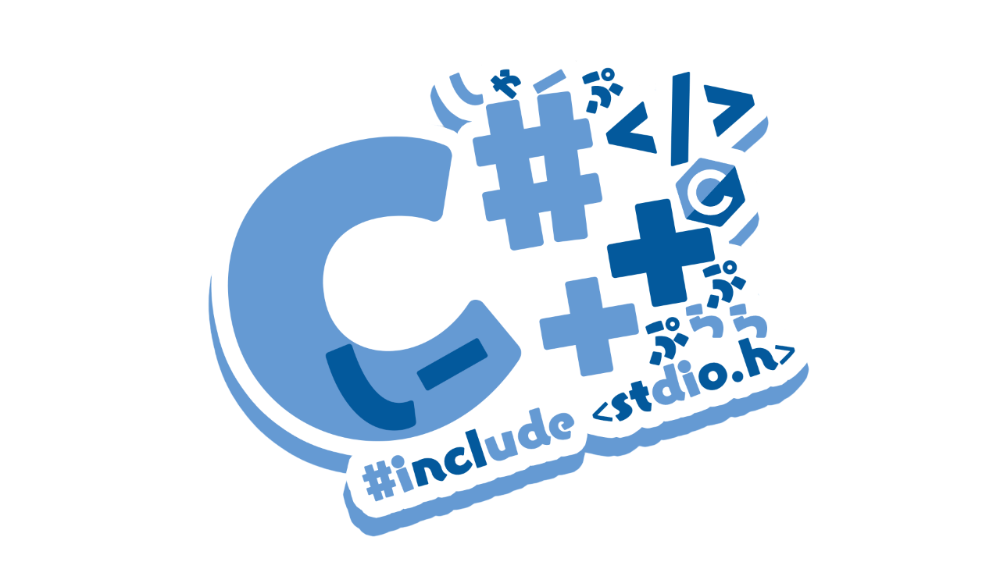
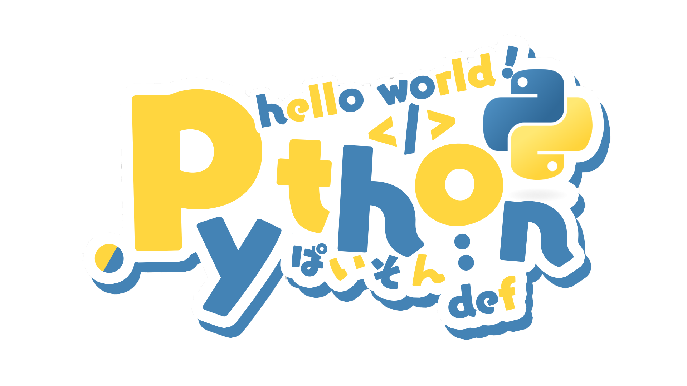

<p align="center">

</p>

<p align="center">
  
</p>
<p align="center">
  
  
  
  
</p>
<div align="center">
  
</div>

## 📮 About Me


```
Code is my canvas, and I paint with logic and creativity.
```

## ✨ Daily Quote

<p align="center">
  
</p>

## 🌱 Growth

<p align="center">


</p>

## 🛠️ Tech Stack

<p align="center">


</p>

<p align="center">
<!-- 技能图标 (保持简约) -->

</p>

## 🌿 Footprints

<!-- 访客计数 (换个样式) -->
<p align="center">
  
</p>


<p align="center">

</p>